# HDO Turnusplan MVP

<!-- AUTO-GENERATED-ARCHITECTURE-START -->
## Application Architecture

```mermaid
graph TB
  subgraph "UI (App Router)"
    subgraph "admin"
      N1["app/(app)/admin/audit/page.tsx"]
      N2["app/(app)/admin/settings/page.tsx"]
      N3["app/(app)/admin/shift-types/page.tsx"]
      N4["app/(app)/admin/teams/page.tsx"]
      N5["app/(app)/admin/users/page.tsx"]
    end
    subgraph "agenda"
      N6["app/(app)/agenda/page.tsx"]
    end
    subgraph "month"
      N7["app/(app)/month/page.tsx"]
    end
    subgraph "standard"
      N8["app/(app)/standard/page.tsx"]
    end
    subgraph "swap"
      N9["app/(app)/swap/page.tsx"]
    end
  end
  subgraph "API Routes"
    subgraph "admin"
      N10["app/api/admin/audit/route.ts"]
      N11["app/api/admin/users/route.ts"]
      N18["app/api/admin/teams/[teamId]/members/route.ts"]
      N19["app/api/admin/teams/[teamId]/members/[membershipId]/route.ts"]
      N20["app/api/admin/users/[id]/route.ts"]
    end
    subgraph "teams"
      N12["app/api/teams/route.ts"]
      N17["app/api/teams/[id]/route.ts"]
    end
    subgraph "notification-settings"
      N13["app/api/notification-settings/route.ts"]
    end
    subgraph "users"
      N14["app/api/users/[id]/notification-preferences/route.ts"]
      N23["app/api/users/route.ts"]
      N33["app/api/users/[id]/route.ts"]
    end
    subgraph "shift-types"
      N15["app/api/shift-types/[id]/route.ts"]
      N16["app/api/shift-types/route.ts"]
    end
    subgraph "shifts"
      N21["app/api/shifts/route.ts"]
      N31["app/api/shifts/bulk/route.ts"]
      N32["app/api/shifts/[id]/route.ts"]
    end
    subgraph "notes"
      N22["app/api/notes/route.ts"]
      N28["app/api/notes/[id]/approve/route.ts"]
    end
    subgraph "swap-requests"
      N24["app/api/swap-requests/route.ts"]
      N25["app/api/swap-requests/[id]/approve/route.ts"]
      N26["app/api/swap-requests/[id]/reject/route.ts"]
      N27["app/api/swap-requests/[id]/execute/route.ts"]
    end
    subgraph "notifications"
      N29["app/api/notifications/route.ts"]
      N30["app/api/notifications/[id]/read/route.ts"]
    end
  end
  subgraph "Data Access"
    N34["lib/prisma.ts"]
  end
  N1 --> N10
  N1 --> N11
  N1 --> N12
  N2 --> N13
  N2 --> N14
  N2 --> N12
  N3 --> N15
  N3 --> N16
  N4 --> N17
  N4 --> N12
  N5 --> N11
  N5 --> N18
  N5 --> N19
  N5 --> N20
  N5 --> N12
  N6 --> N21
  N6 --> N22
  N6 --> N12
  N6 --> N23
  N7 --> N21
  N7 --> N12
  N8 --> N23
  N8 --> N21
  N8 --> N12
  N9 --> N23
  N9 --> N24
  N9 --> N21
  N9 --> N25
  N9 --> N26
  N9 --> N27
  N9 --> N12
  N10 --> N34
  N18 --> N34
  N19 --> N34
  N11 --> N34
  N20 --> N34
  N22 --> N34
  N28 --> N34
  N13 --> N34
  N29 --> N34
  N30 --> N34
  N16 --> N34
  N15 --> N34
  N31 --> N34
  N21 --> N34
  N32 --> N34
  N24 --> N34
  N25 --> N34
  N27 --> N34
  N26 --> N34
  N12 --> N34
  N17 --> N34
  N23 --> N34
  N14 --> N34
  N33 --> N34
  style N34 fill:#38bdf8,color:#0f172a
```



## Component Hierarchy

```mermaid
graph TD
  N1["app/(app)/admin/layout.tsx"]
  N2["app/(app)/layout.tsx"]
  N3["app/(app)/settings/layout.tsx"]
  N4["app/layout.tsx"]
  N5["app/(app)/admin/audit/page.tsx"]
  N6["app/(app)/admin/page.tsx"]
  N7["app/(app)/admin/settings/page.tsx"]
  N8["app/(app)/admin/shift-types/page.tsx"]
  N9["app/(app)/admin/teams/page.tsx"]
  N10["app/(app)/admin/users/page.tsx"]
  N11["app/(app)/agenda/page.tsx"]
  N12["app/(app)/month/page.tsx"]
  N13["app/(app)/page.tsx"]
  N14["app/(app)/settings/page.tsx"]
  N15["app/(app)/settings/users/page.tsx"]
  N16["app/(app)/standard/page.tsx"]
  N17["app/(app)/swap/page.tsx"]
  N18["app/page.tsx"]
  N19["components/schedule/WeekGrid.tsx"]
  N20["components/BulkShiftModal.tsx"]
  N21["components/schedule/ShiftModal.tsx"]
  N22["components/layout/Navigation.tsx"]
  N23["components/auth/RoleSwitcher.tsx"]
  N24["components/layout/NotificationsPanel.tsx"]
  N2 --> N1
  N4 --> N2
  N2 --> N3
  N1 --> N5
  N1 --> N6
  N1 --> N7
  N1 --> N8
  N1 --> N9
  N1 --> N10
  N2 --> N11
  N2 --> N12
  N2 --> N13
  N3 --> N14
  N3 --> N15
  N2 --> N16
  N2 --> N17
  N4 --> N18
  N16 --> N19
  N16 --> N20
  N19 --> N21
  N12 --> N21
  N2 --> N22
  N22 --> N23
  N22 --> N24
  style N4 fill:#FF6B35,color:#111827
  style N18 fill:#FF6B35,color:#111827
```


<!-- AUTO-GENERATED-ARCHITECTURE-END -->


En moderne web-basert vaktplanleggingssystem (turnusplan) for Helsetjenestens driftsorganisasjon for nødnett HF (HDO). 

## Teknologier

- **Next.js 14+** med App Router
- **TypeScript**
- **TailwindCSS** for styling
- **shadcn/ui** komponenter
- **React Hook Form + Zod** for skjemaer og validering
- **TanStack Table** for tabeller
- **date-fns** for dato-håndtering
- **Zustand** for klient-tilstand
- **Prisma + SQLite** for database (kan enkelt byttes til Postgres)

## Funksjoner

### Kjernefunksjoner

1. **Standard plan** - Ukesvis grid-visning med ansatte som rader og dager som kolonner
2. **Måned** - Kalender-visning med aggregert informasjon
3. **Agenda** - Liste over kommende vakter og notater
4. **Vaktbytter** - Ansatte kan be om vaktbytter, ledere kan godkjenne/utføre
5. **Admin** - Administrasjon av team, brukere, vakttyper og innstillinger

### Roller

- **Admin**: Kan administrere team, brukere, vakttyper
- **Leader**: Kan opprette/redigere vakter, utføre vaktbytter, godkjenne fravær/sykdom
- **Employee**: Kan se alle planer, be om fravær/sykdom, be om vaktbytter

### Notater og fravær

- Ansatte kan opprette notater for fravær eller sykdom
- Disse markeres som "pending" og må godkjennes av leder
- Leder kan godkjenne eller avvise forespørsler

## Installasjon og oppsett

### Forutsetninger

- Node.js 18+ og npm
- Git

### Steg 1: Installer avhengigheter

```bash
npm install
```

### Steg 2: Sett opp database

```bash
# Opprett database og kjør migrasjoner
npx prisma db push

# Seed database med demo-data
npm run db:seed
```

### Steg 3: Start utviklingsserveren

```bash
npm run dev
```

Åpne [http://localhost:3000](http://localhost:3000) i nettleseren.

## Demo-guide

### Rollebytte

Systemet bruker mock-autentisering for demo-formål. I navigasjonsbaren (øverst til høyre) finner du en dropdown for å bytte mellom brukere med forskjellige roller:

1. **Admin User** - Full tilgang til alt
2. **Leader User** - Kan administrere vakter og godkjenne forespørsler
3. **Ansatte** - Kan se planer og be om fravær/vaktbytter

### Demo-data

Seed-scriptet oppretter:
- 1 team: "HDO - Turnus"
- 8 brukere: 1 admin, 1 leader, 6 ansatte
- Flere vakttyper: Fri, Dag, N1, N2, K1, D2
- 4 uker med eksempelvakter

### Teste funksjoner

1. **Se vaktplan**: Gå til "Standard plan" og naviger mellom uker
2. **Opprett vakt**: Klikk på en tom celle og opprett en vakt (kun Leader/Admin)
3. **Be om vaktbytte**: Gå til "Vaktbytter" som ansatt og opprett en forespørsel
4. **Godkjenn vaktbytte**: Bytt til Leader-rolle og godkjenn/utfør vaktbytter
5. **Administrer**: Gå til "Admin" for å administrere team, brukere og vakttyper

## Prosjektstruktur

```
bachelor_HDO/
├── app/
│   ├── (app)/              # App-ruter med layout
│   │   ├── standard/       # Standard plan visning
│   │   ├── month/          # Månedsvisning
│   │   ├── agenda/         # Agenda-liste
│   │   ├── swap/           # Vaktbytter
│   │   └── admin/          # Admin-seksjoner
│   └── api/                # API-ruter
├── components/
│   ├── ui/                 # shadcn/ui komponenter
│   ├── layout/             # Navigasjon og varsler
│   ├── auth/               # Rollebytter og auth UI
│   └── schedule/           # Vaktplan-komponenter
├── lib/
│   ├── prisma.ts           # Prisma-klient
│   ├── auth/               # Mock-autentisering
│   ├── date-utils.ts       # Dato-hjelpefunksjoner
│   └── notifications/      # Varslingsfunksjoner
└── prisma/
    ├── schema.prisma       # Database-skjema
    └── seed.ts             # Seed-script
```

## Database

Systemet bruker SQLite for MVP, men kan enkelt byttes til Postgres ved å endre `DATABASE_URL` i `.env` og oppdatere Prisma-schemaet.

### Viktige modeller

- **Team**: Organisasjonsteam
- **User**: Brukere med roller (ADMIN, LEADER, EMPLOYEE)
- **ShiftType**: Vakttyper med farger og standardtider
- **Shift**: Planlagte vakter
- **Note**: Notater (generelle, fravær, sykdom) med status
- **SwapRequest**: Vaktbytteforespørsler med status
- **Notification**: Varsler for brukere

## Videre utvikling

### Planlagte forbedringer

1. **Azure AD-integrasjon**: Erstatt mock-auth med ekte Azure AD (Entra ID)
2. **Postgres-migrering**: Bytt fra SQLite til Postgres for produksjon
3. **E-postvarsler**: Implementer ekte e-post-sending
4. **SMS-integrasjon**: Integrer med eksisterende SMS-endpoint
5. **Avansert planlegging**: Automatisk vaktplanlegging, konfliktdeteksjon
6. **Mobilapp**: React Native-app for mobil

## Lisens

Dette prosjektet er bygget som en del av en bacheloroppgave.

## Kontakt

For spørsmål eller tilbakemeldinger, kontakt prosjekteier.

